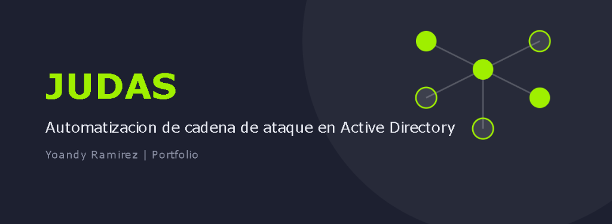
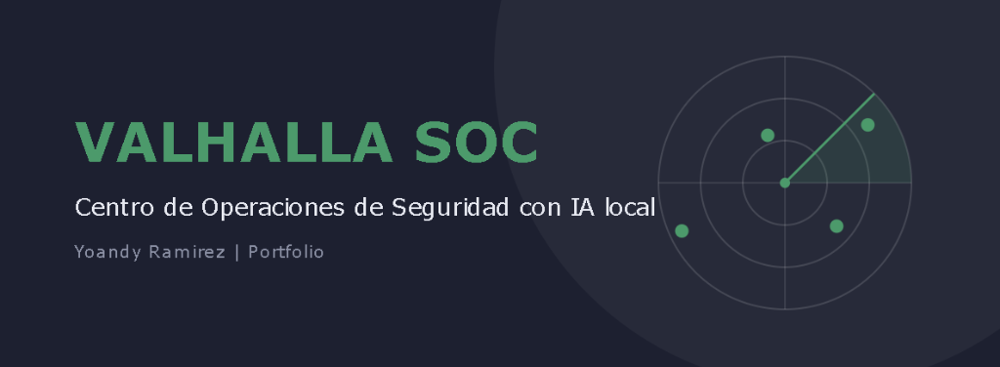
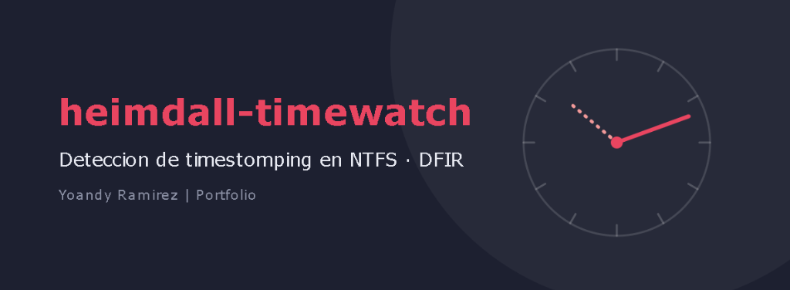
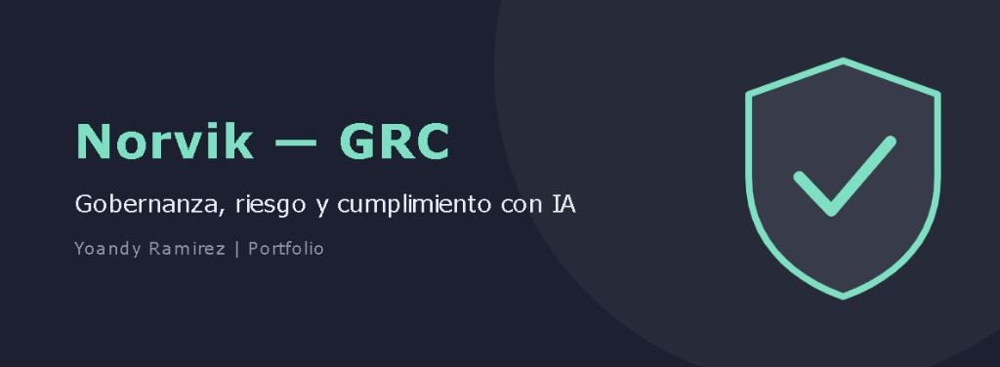
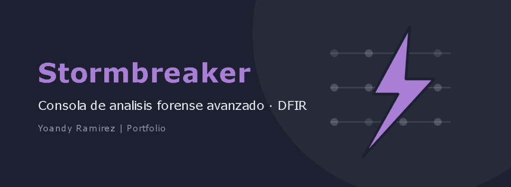

<!-- ============================================================
     YOANDY RAMÍREZ DELGADO | heindall92 — Enterprise Security Portfolio
     Glass Minimal Style | Accent Color: Cyber Blue (#58a6ff)
     ============================================================ -->

[+%7C+Red+Team+Mindset;45%2B+machines+compromised+%7C+HTB+%C2%B7+THM;DFIR+%26+Blue+Team+tooling+builder;Breaking+things+legally%2C+building+the+tools)](https://git.io/typing-svg)

&nbsp;

&nbsp;

&nbsp;

 

## Sobre mí

Pentester Junior y Red Team Operator en transición desde sistemas IT, con **4+ años como Técnico de Sistemas y Redes**. Certificado **eJPTv2** (86%), cursando el **Máster en Ciberseguridad & IA** en Evolve Academy, con **45+ máquinas** comprometidas en HTB, TryHackMe, HackMyVM y The Hacker Labs.

No solo rompo cosas (legalmente): también las construyo. Desarrollo mis propias herramientas de **pentesting, GRC y DFIR** —automatización de ataques a Active Directory, un SOC completo con IA local y un detector anti-forense NTFS mapeado a MITRE ATT&CK— y las documento con calidad profesional.

📍 Lepe, Huelva — abierto a remoto. Próximos objetivos: **CPTS** y **OSCP** (2026).

<b>🇬🇧 Read in English (Executive Summary)</b>

 

Junior Pentester and Red Team Operator transitioning from IT systems, with **4+ years as a Systems & Networks Technician**. **eJPTv2 certified** (eLearnSecurity, 86%), currently pursuing a **Master's in Cybersecurity & AI** at Evolve Academy, with **45+ machines** compromised across HTB, TryHackMe, HackMyVM and The Hacker Labs.

I don't just break things (legally) — I build them too. I develop my own **pentesting, GRC and DFIR tooling** — Active Directory attack-chain automation, a full AI-assisted SOC, and an NTFS anti-forensics detector mapped to MITRE ATT&CK — and document all of it to a professional standard.

📍 Lepe, Spain — open to remote. Next up: **CPTS** and **OSCP** (2026).

 

## Proyectos

<table border="0" cellspacing="10" cellpadding="0" width="100%">
<tr>
<td width="50%" valign="top"></td>
<td width="50%" valign="top"></td>
</tr>
<tr>
<td width="50%" valign="top"></td>
<td width="50%" valign="top"></td>
</tr>
<tr>
<td width="50%" valign="top"></td>
<td width="50%" valign="top"></td>
</tr>
</table>

<a href="https://github.com/heindall92?tab=repositories">Ver todos los repositorios en GitHub →</a>

 

## Stack

| Área | Tecnologías y Herramientas |
|:---|:---|
| **Ofensiva** | `nmap` · `metasploit` · `burpsuite` · `bloodhound` · `hashcat` · `ffuf` · `sqlmap` · `gobuster` · `impacket` · `crackmapexec` |
| **DFIR / Blue** | `wazuh SIEM` · `mitre att&ck` · `ntfs forensics` · `cowrie honeypot` · `wireshark` · `sysmon` · `event log parsing` |
| **Dev / IA** | `python` · `bash` · `typescript` · `docker & compose` · `git` · `ollama (LLMs locales)` · `pyside6 (GUI)` |
| **Metodología** | `owasp top 10` · `nist csf v2.0` · `iso 27001` · `cis controls v8` · `obsidian (threat documentation)` |

 

## Certificaciones

| | Certificación / Especialización | Emisor / Entidad | Estado |
|:---:|:---|:---|:---:|
| 🎯 | **eJPTv2** — Junior Penetration Tester | eLearnSecurity |  |
| 🟩 | **HTB Academy** — Jr. Cybersecurity Analyst Path | HackTheBox |  |
| 🎓 | **Máster en Ciberseguridad & Inteligencia Artificial** | Evolve Academy |  |
| 🌐 | **Google · Cisco · IBM** — IT, Networks & SecOps | Google / Cisco / IBM |  |
| ⚡ | **CPTS → OSCP** | HackTheBox / OffSec |  |

 

## GitHub Stats

  

 

---

<i>"4 años rompiendo sistemas — primero por accidente, ahora por metodología."</i>

  

  

