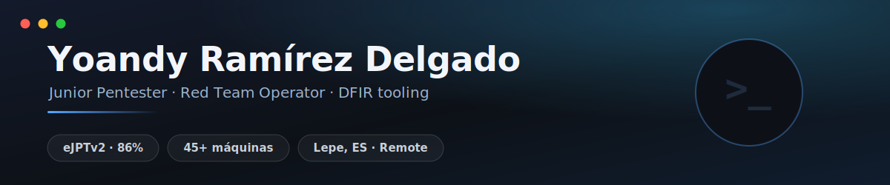

<!-- ============================================================
     YOANDY RAMÍREZ DELGADO | heindall92 — Enterprise Security Portfolio
     Glass Minimal Style | Accent Color: Cyber Blue (#58a6ff)
     ============================================================ -->

[+%7C+Red+Team+Mindset;45%2B+machines+compromised+%7C+HTB+%C2%B7+THM;DFIR+%26+Blue+Team+tooling+builder;Breaking+things+legally%2C+building+the+tools)](https://git.io/typing-svg)

&nbsp;

&nbsp;

&nbsp;

 

## Sobre mí

Pentester Junior y Red Team Operator en transición desde sistemas IT, con **4+ años como Técnico de Sistemas y Redes**. Certificado **eJPTv2** (86%), cursando el **Máster en Ciberseguridad & IA** en Evolve Academy, con **45+ máquinas** comprometidas en HTB, TryHackMe, HackMyVM y The Hacker Labs.

No solo rompo cosas (legalmente): también las construyo. Desarrollo mis propias herramientas de **pentesting, GRC y DFIR** —automatización de ataques a Active Directory, un SOC completo con IA local y un detector anti-forense NTFS mapeado a MITRE ATT&CK— y las documento con calidad profesional.

📍 Huelva, España — Híbrido (Huelva, Madrid y alrededores) / Remoto (España, Europa/EU) &nbsp;&middot;&nbsp; Próximos objetivos: **CPTS** y **OSCP** (En preparación activa).

<b>🇬🇧 Read in English (Executive Summary)</b>

 

Junior Pentester and Red Team Operator transitioning from IT systems, with **4+ years as a Systems & Networks Technician**. **eJPTv2 certified** (eLearnSecurity, 86%), currently pursuing a **Master's in Cybersecurity & AI** at Evolve Academy, with **45+ machines** compromised across HTB, TryHackMe, HackMyVM and The Hacker Labs.

I don't just break things (legally) — I build them too. I develop my own **pentesting, GRC and DFIR tooling** — Active Directory attack-chain automation, a full AI-assisted SOC, and an NTFS anti-forensics detector mapped to MITRE ATT&CK — and document all of it to a professional standard.

📍 Huelva, Spain — Hybrid (Huelva, Madrid & surroundings) / Remote (Spain, Europe/EU) &nbsp;&middot;&nbsp; Next up: **CPTS** & **OSCP** (Currently in active preparation).

 

## Proyectos

<table border="0" cellspacing="10" cellpadding="0" width="100%">
<tr>
<td width="50%" valign="top"></td>
<td width="50%" valign="top"></td>
</tr>
<tr>
<td width="50%" valign="top"></td>
<td width="50%" valign="top"></td>
</tr>
<tr>
<td width="50%" valign="top"></td>
<td width="50%" valign="top"></td>
</tr>
</table>

<a href="https://github.com/heindall92?tab=repositories">Ver todos los repositorios en GitHub →</a>

 

## 💻 Tech Stack

| Área | Tecnologías y Herramientas |
|:---|:---|
| **⚔️ Hacking Ofensivo / AD** |           |
| **🕵️ DFIR & Blue Team** |        |
| **⚙️ Desarrollo & IA Local** |      -111111?style=for-the-badge&logo=ollama&logoColor=white) -41CD52?style=for-the-badge&logo=qt&logoColor=white) |
| **🧠 Metodologías y GRC** |      |

 

## Certificaciones

| | Certificación / Especialización | Emisor / Entidad | Estado |
|:---:|:---|:---|:---:|
| 🎯 | **eJPTv2** — Junior Penetration Tester | eLearnSecurity |  |
| 🟩 | **HTB Academy** — Jr. Cybersecurity Analyst Path | HackTheBox |  |
| 🎓 | **Máster en Ciberseguridad & Inteligencia Artificial** | Evolve Academy |  |
| 🌐 | **Google · Cisco · IBM** — IT, Networks & SecOps | Google / Cisco / IBM |  |
| ⚡ | **CPTS → OSCP** | HackTheBox / OffSec |  |

 

## 🤝 ¡Conectemos! 🌟

Siempre estoy abierto a nuevos desafíos, colaboraciones en desarrollo de herramientas **Red Team / DFIR**, integraciones de **Inteligencia Artificial local** orientada a ciberseguridad, o simplemente para charlar sobre tendencias tecnológicas y auditorías de seguridad.

<table border="0" cellspacing="10" cellpadding="0" width="100%">
<tr>
<td width="33%" align="center" valign="top">
  
    
  <b>Perfil Profesional</b> Networking y contacto corporativo
</td>
<td width="33%" align="center" valign="top">
  
    
  <b>Propuestas y Oportunidades</b> Proyectos y colaboraciones
</td>
<td width="33%" align="center" valign="top">
  
    
  <b>Mis Proyectos</b> Código fuente y herramientas
</td>
</tr>
</table>

 

📍 **Huelva, España** &nbsp;&middot;&nbsp; 🌐 **Disponible para trabajo híbrido / remoto** &nbsp;&middot;&nbsp; 💬 **Español (Nativo) & Inglés (Profesional)**

  

  

